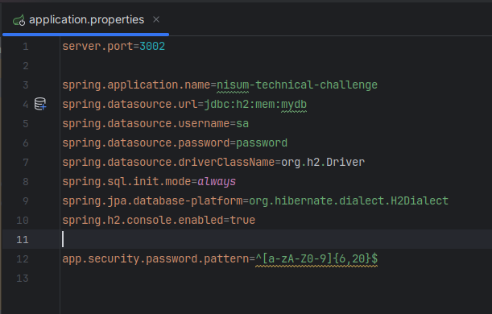
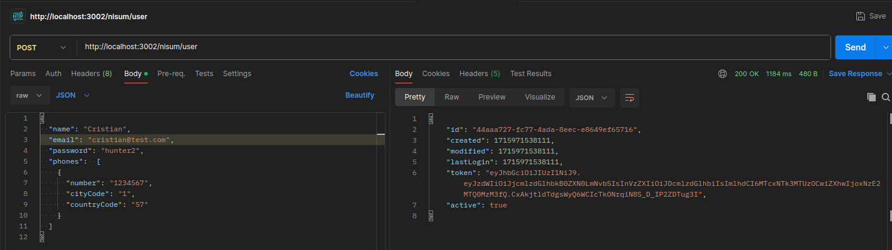
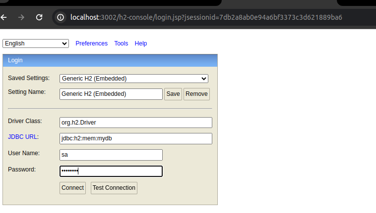
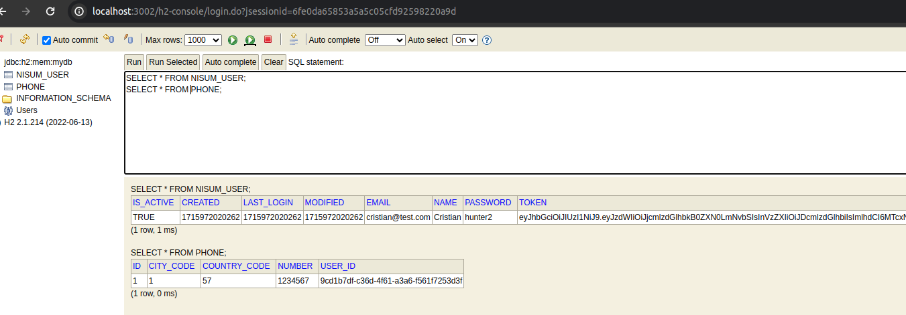

# API Create User Nisum

This technical challenge is an API to register new users.

## Content Table

- [Introduction](#Introduction)
- [Installation](#Installation)
- [Use](#Use)
- [Endpoints](#Endpoints)
- [DataBase](#Database)
- [Author](#Author)

## Introduction

The Nisum User Creation API allows you to create user records in an H2 database and generate a JWT.

## Installation

To run the User Creation API, follow these steps:

1. Clone the repository: git clone https://github.com/CristianEPT/nisum-technical-challenge.git
2. Navigate to the project directory: cd nisum-technical-challenge
3. Build the project: gradle clean build
4. Run the application: java -jar build/libs/nisum-technical-challenge-0.0.1-SNAPSHOT.jar

## Use

You can find the artifact configurations at:

`./nisum-technical-challenge/src/main/resources/application.properties`

Here you will find the database and regular expression configurations. Remember to modify them before running the
artifact.

Once the API is up and running, you can send HTTP requests to the available endpoint to register users.

## Endpoints

You can find the API documentation here: [Api Documentation](ApiDocumentation.yaml)

The Users API provides the following endpoints:

`POST /nisum/user`: Creates a record in the database and returns user information.

You can execute the following curl command from a terminal to interact with the API:

`curl --location 'http://localhost:3002/nisum/user' \
--header 'Content-Type: application/json' \
--data-raw '{
"name": "Cristian",
"email": "cristian@test.com",
"password": "hunter2",
"phones":  [
{
"number": "1234567",
"cityCode": "1",
"countryCode": "57"
}
]
}'`

or from Postman, as follows:

## Database

The database configurations can be found in the application.properties file. Make sure to provide the correct
configurations
before running the application.

Once the project is up and running, you can visually access the database via http://localhost:3002/h2-console.

You will be prompted for credentials as shown below:

Once logged in and having already created users, you can execute the following SELECT statements to view the persisted
data.

## Author

This README.md file was created by [Cristin Piña](https://github.com/CristianEPT).
