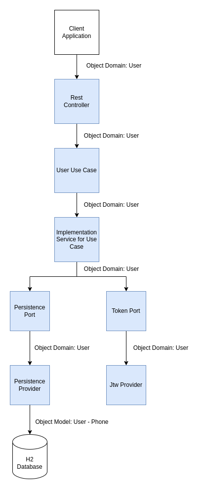

# Solution Diagram 

The diagram below illustrates the architecture and data flow of the solution

This diagram provides a clearer visualization of the solution. It represents the data flow and interactions between the client application, the REST controller, the use case handler, the persistence port, the repositories, and the H2 database.

